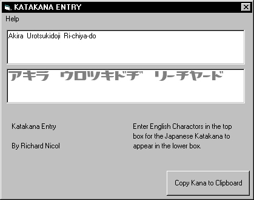

## JAPANESE KATAKANA ENTRY

### Description

This code is now out of date, please see the entry New Japanese Kana Entry for a newer and more complete version.

This version's still here tho, so you can get the fonts/code and that. ;-)
 
### More Info
 

             |
---                |---
**Submitted On**   |2000-02-23 16:37:44
**By**             |[Rik](https://github.com/Planet-Source-Code/PSCIndex/blob/master/ByAuthor/rik.md)
**Level**          |Intermediate
**User Rating**    |5.0 (15 globes from 3 users)
**Compatibility**  |VB 5\.0, VB 6\.0
**Category**       |[Complete Applications](https://github.com/Planet-Source-Code/PSCIndex/blob/master/ByCategory/complete-applications__1-27.md)
**World**          |[Visual Basic](https://github.com/Planet-Source-Code/PSCIndex/blob/master/ByWorld/visual-basic.md)
**Archive File**   |[CODE\_UPLOAD35672232000\.zip](https://github.com/Planet-Source-Code/rik-japanese-katakana-entry__1-6221/archive/master.zip)

